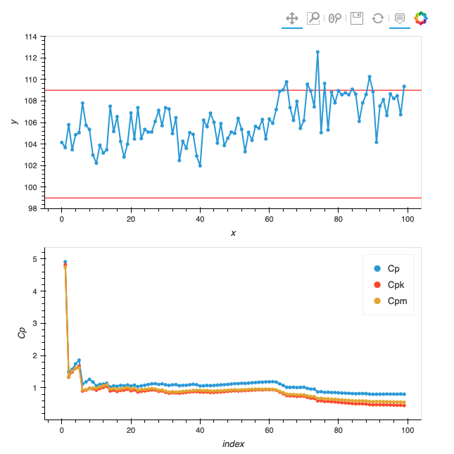

# HoloViews + Flask mini-tutorial
HoloViews data visualization in a Flask web app

## Environment set-up
It is recommended that you create a virtual environment.

Use the `requirements.txt` file to set up the working environment:
```commandline
pip install -r requirements.txt
```

Alternatively, install the following packages in your environment manually:
```commandline
pip install holoviews
pip install flask
pip install scipy
```

## Point of entry: Runnable files
The runnable Python files are in the `code/` subdirectory.
Run and explore these files to learn using HoloViews with Flask in a step-by-step manner.

- `code/step1.py`: Step 1. Rendering two HoloViews plots; each plot is saved in a separate HTML file; pure HoloViews, no Flask yet
- `code/step2.py`: Step 2. Creating a simple web app and displaying two plots on the same page
- `code/step3.py`: Step 3. Creating a web app with a plot and adding interactivity
- `code/step4.py`: Step 4. A full-scall web app for performing process capability analysis

## HTML templates
It is common for a Flask application to have at least one HTML template.
- `code/templates/step2_index.html`: Jinja2 template necessary for the functioning of `step2.py`
- `code/templates/step3_index.html`: Jinja2 template necessary for the functioning of `step3.py`
- `code/templates/step4_index.html`: Jinja2 template necessary for the functioning of `step4.py`

## Auxiliary code
- `aux_code/generate_changepoint_dataset.py`: Python routine for generating the `changepoint.csv` dataset

## Datasets
- `data/scagliarini-simulated.csv`: Table 13 from [Scagliarini (2018)](http://amsacta.unibo.it/5413/1/Quaderni_2016_5_Scagliarini_Sequential.pdf)
- `data/softdrinkco2.csv`: Table 15 from [Scagliarini (2018)](http://amsacta.unibo.it/5413/1/Quaderni_2016_5_Scagliarini_Sequential.pdf); LSL = 5.5, USL = 8.5 
- `data/salazar.csv`: Data from
[here](https://towardsdatascience.com/process-capability-analysis-with-r-1a4ccc2d4270).
LSL = 740, USL = 760
- `data/changepoint.csv`: Simulated data with changepoint in the middle

## Output
- `output/`: The directory where the output from `step1.py` will be saved.

## Sample output (web app)
This is what a fragment of sample output at Step 4 looks like:

In fact, this graph makes sense in terms of Process Capability Analysis.
The top graph is the process; the bottom graph is the three
[procecess capability indices](https://en.wikipedia.org/wiki/Process_capability_index).
The process experiences the change of mean at T of around 60;
this finds its reflection in the indices in the bottom graph.

This example is aimed at demonstrating the use of HoloViews + Flask bundle
in real-life data visualization and analysis.
