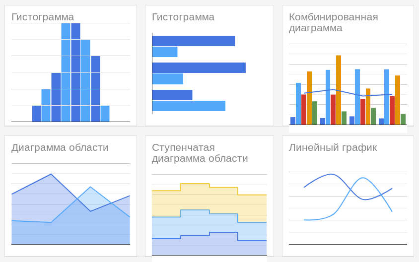
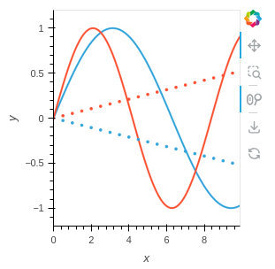

# Как мы упростили процесс интерактивной визуализации данных в веб-приложении, используя HoloViews


Идея этой статьи родилась, когда наша команда занималась разработкой минимально жизнеспособного продукта (MVP) внутренней веб-системы, важной составляющей которой было визуальное представление данных, а именно, результатов работы различных анализаторов исходного кода программного обеспечения. Из всего разнообразия библиотек визуализации в веб мы выбрали HoloViews, поскольку она в наибольшей степени соответствовала компетенциям нашей команды, костяк которой в силу специфики проекта составляли
специалисты по анализу данных.
Однако для успешной интеграции HoloViews в веб-приложение нам как разработчикам пришлось проявить и некоторую изобретательность.
Мы посчитали, что имеет смысл поделиться этим опытом, поскольку в одном месте подобный материал до сих пор нигде не был собран.

При разработке веб-приложений нередко возникает потребность предоставить пользователю те или иные данные в наглядном виде. Причем желательно так, чтобы пользователь мог с этими данными взаимодействовать в своем браузере. Может показаться логичным, что для достижения подобного необходимы глубокие знания Frontend-разработки в целом и языка JavaScript в частности, которые не очень распространены среди дата-аналитиков и дата-сайентистов, программирующих, как правило, на Python. Однако, с помощью библиотеки HoloViews можно достичь подобного с использованием исключительно языка Python. В статье мы расскажем о библиотеке HoloViews, позволяющей без лишних усилий создавать интерактивные графики для визуализации данных, и о том, как эти графики легко интегрировать в веб-приложение. Статья может быть интересна дата-аналитикам, дата-сайентистам, Backend-разработчикам и руководителям проектов, связанных с анализом данных.

## Интерактивная визуализация данных на веб-странице

Визуализация данных — эффективный способ понимания структуры данных и выявления закономерностей в данных. Как правило, для визуализации данных специалисты по анализу данных либо традиционно используют специализированные программы, такие как SPSS, SAS, JMP, R или даже Excel, либо свободные библиотеки языка Python, такие как matplotlib, seaborn или ggplot. Отметим, что из всех языков программирования общего назначения именно Python входит в стандартный набор компетенций специалиста по анализу данных.

Часто нужно отобразить тот или иной график и на веб-странице. Статистический график может понадобиться на мощном веб-сервисе в "большом" интернете — например, помесячная статистика прочтений сообщения в социальной сети или динамика курсов валют на сайте банка. Визуализация может пригодиться и на внутреннем интернет-ресурсе предприятия: например, графики планового и непланового ремонта и простоя оборудования на производстве или динамика количества срабатываний статического анализатора у разработчика программного обеспечения. При этом современные эстетические стандарты требуют, чтобы график выглядел на сайте органично, не нарушая его общего дизайна.

Привычные для дата-сайентиста библиотеки визуализации,
такие как matplotlib или seaborn, не подходят
для построения графиков внутри веб-страницы. К счастью, есть множество библиотек, позволяющих строить графики на веб-странице: D3js, C3js, Highcharts, Chart.js, Google Charts и прочее. Как правило, все такие библиотеки поддерживают более-менее стандартный набор статистических графиков: круговые диаграммы, гистограммы и столбчатые диаграммы, диаграммы рассеяния, линейные графики, "ящики с усами", тепловые карты и прочее, — наряду с возможностью комбинировать эти графики между собой.


<figure>
  
  <figcaption>Пример графиков Google Charts<br>Источник: https://developers.google.com/chart/interactive/docs/gallery</figcaption>
</figure>

<figure>
  <br>
  
  <figcaption>Пример графиков C3js<br>Источник: https://c3js.org/examples.html</figcaption>
</figure>

При этом графики, полученные с помощью подобных библиотек, "из коробки", являются интерактивными. Они дают возможность пользователю взаимодействовать с ними. Например, показывать значения, соответствующие точке на графике, на которую наведен курсор мыши. Или просто выделять столбец гистограммы цветом, на которую указал пользователь. Нередко библиотеки интерактивной визуализации позволяют запрограммировать и сложную реакцию на действия пользователя с применением JavaScript: можно запрограммировать "перетаскивание" точки графика пользователем вместе с обновлением текстового содержимого сайта, или отражать подробности при щелчке на столбец гистограммы.

Стоит отметить, что интерактивный график может обеспечить лучший пользовательский опыт, чем простой статичный график: можно дать пользователю возможность самому задать какие-то параметры, детальнее исследовать ту часть данных которая его может интересовать, применять фильтры к данным и т.п. Это, как правило, способствовует лучшему вовлечению пользователя в процесс анализа данных и выдвижения гипотез о закономерностях в данных, становлению доверительных отношений между пользователем и разработчиком и, вкупе с профессиональными знаниями пользователя в его области, дает синергетический эффект, радикально повышая скорость и качество работы с данными.

Естественно, едва ли можно назвать лучшую библиотеку для интерактивной визуализации. Каждая библиотека имеет свои достоинства и недостатки. Скажем, обратной стороной большей гибкости библиотеки будет более высокий порог вхождения и сложность разработки (как в D3js), и наоборот, библиотека, которую легко изучить может оказаться ограничивающей в плане возможных графиков (как Google Charts).

*При выборе библиотеки визуализации стоит внимательно проанализировать круг задач, которые будут ей решаться: если все ограничивается стандартными графиками, то лучше использовать библиотеку "попроще". Если же требуется нетривиальная визуализация со сложным взаимодействием с пользователем, то иной раз без D3 не обойтись.*

Довольно крупную "ложку дегтя" с точки зрения типичного специалиста по анализу данных добавляет то, что очень многие библиотеки визуализации данных в вебе "говорят на том же языке", что и веб-браузер — на JavaScript. А именно, все вышеперечисленные библиотеки (D3js, C3js, Highcharts, Chart.js, Google Charts) требуют умения работать с JavaScript. В отличие от Python, компетенции в JavaScript встречаются у дата-сайентистов не так часто.

Понятно, что для крупного веб-ресурса привлечение дополнительного JavaScript-разработчика к процессу визуализации и неизбежные заботы по выстраиванию коммуникации между такими разными JavaScript-разработчиками и дата-сайентистами, возможно, и не будет проблемой на этапе вывода разработки в production. Но для небольшого проекта на внутреннего пользователя, или этапа разработки MVP это может оказаться серьезным и даже непозволительным перерасходованием ресурсов.

Компромиссом может стать использование библиотеки визуализации, которая не требовала бы знания JavaScript, а работала бы на "родном" для дата-сайентистов Python. При таком раскладе графики, запрограммированные дата-сайентистами, можно было бы без проблем включить в код, исполняемый на стороне Backend. Либо нативно, при условии, что Backend работает на Python — что встречается довольно часто, — либо как компонент в микросервисной архитектуре. При этом контур, в котором работает дата-сайентист, —от подготовки данных до генерации графиков — оставался бы подконтрольным дата-сайентисту с минимумом вмешательства со стороны других разработчиков.

Такие библиотеки тоже есть: это Bokeh и HoloViews. "Рабочий язык" этих библиотек — Python. Но при выполнении они автоматически генерируют JavaScript-код, который строит интерактивный график, будучи открытым в браузере. Надо отметить, что, с одной стороны, HoloViews сам использует Bokeh, а с другой — значительно проще последнего в использовании. *Здесь, кстати, просматривается аналогия между JavaScript-библиотеками D3js и C3js: C3js тоже более проста в использовании и тоже опирается на D3js.*

В **«Группе Астра»** мы используем HoloViews для проектирования нашей внутренней системы отслеживания потенциальных уязвимостей в коде. HoloViews позволяет нам быстро прототипировать наши графики и быстро получать обратную связь от наших пользователей. При этом мы избегаем сложностей, связанных с интеграцией разных языков программирования, и расфокусировки внимания разработчиков, связанной с необходимостью работать на двух языках (Python и JavaScript). Со временем некоторые графики в наших веб-приложениях меняются на Frontend-библиотеки, но некоторые так и остаются в виде HoloViews.

<figure>
  <br>
  <figcaption>Пример графиков HoloViews<br>Источник: https://holoviews.org/reference/index.html</figcaption>
</figure>

В следующих разделах мы детально рассмотрим пакет HoloViews и интеграцию между HoloViews и веб-приложением на примере популярного веб-фреймворка Flask.


## Использование библиотеки HoloViews для построения графиков в веб-приложении

### Примеры графиков в HoloViews

Перед началом работы пакет HoloViews следует установить в систему. HoloViews можно установить с помощью стандартной команды:

```bash
pip install holoviews
```

При этом автоматически установится пакет `bokeh` и ряд других необходимых пакетов.

Начнем с простого примера. Построим ломаную, соединяющую точки из набора данных.
В качестве набора данных будут выступать котировки акций Группы Астра
(8 биржевых дней, с 15 марта 2024 г. по 26 марта 2024 г. включительно).

```Python
# hvplot.py
import holoviews as hv
import pandas as pd
hv.extension('bokeh')

df = pd.DataFrame({
    'День': [1, 2, 3, 4, 5, 6, 7, 8],
    'Цена акции, руб.': [561.3, 563.5, 564.2, 575.75, 611.0, 596.4, 650.2, 713.0]
})

plot = hv.Curve(df)

hv.save(plot, 'plot.html')
```

Запустив этот код, мы получим файл `plot.html`, открыв который в браузере, мы увидим:

<figure>
  <br>
  <figcaption>Линейный график, сгенерированный HoloViews</figcaption>
</figure>

Отметим, что пользователь может делать с графиком следующее:

* Увеличивать и уменьшать масштаб;
* Выбирать область для увеличения;
* Тянуть график мышью;
* Сохранить график себе на диск в формате png.

Отметим, что мы получили такие возможности, выполнив всего лишь несколько строк кода.

Что же делает код, который мы написали?

* Для начала импортируются необходимые библиотеки. Стандартное сокращение для библиотеки `holoviews` — `hv`.
* Строка `hv.extension...` говорит о том, что HoloViews будет работать на базе Bokeh.
* Задается набор данных `df`, которые мы и будем визуализировать.
* Генерируется объект `plot` типа `holoviews.element.chart.Curve`, содержащий наш график.
* Объект `plot` сохраняется в HTML-файл.

Если открыть получившийся html-файл не в браузере, а в текстовом редакторе, то мы увидим следующие особенности файла:

1. Внутри HTML-заголовка (`<head>`) присутствует загрузка JavaScript-скриптов с Bokeh, типа такого:

```HTML
<script type="text/javascript" src="https://cdn.bokeh.org/bokeh/release/bokeh-2.4.3.min.js"></script>
```

1. Внутри HTML-тела (`<body>`) присутствует `<div>` и `<script>`.

`<script>` внутри `<body>` отвечает за собственно построение графика.

Важно, что мы сами не пишем ни HTML, ни JavaScript-код: все генерируется автоматически со стороны Python.

Аналогично можем построить другие графики.

Например, изменим наш график, задав ширину и высоту графика, толщину и цвет точки, а также добавив инструмент `hover`
(он отображает данные при наведении на элемент графика).
Для этого заменим в предыдущем примере строчку, начинающуюся на `plot = hv.Curve(...)` на следующую строчку:

```Python
plot = hv.Curve(df).opts(width=500, height=400, line_width=4, color='red', tools=['hover'])
```

<figure>
  <br>
  <figcaption>Линейный график, сгенерированный HoloViews</figcaption>
</figure>

Построим столбчатую диаграмму на основании тех же данных:

```
plot = hv.Bars(df).opts(width=500, height=400, line_width=1, color='cyan', tools=['hover'])
```

<figure>
  <br>
  <figcaption>Столбчатая диаграмма, сгенерированная HoloViews</figcaption>
</figure>

В качестве еще одного примера построим "ящик с усами" для нашего набора данных:

```Python
plot = hv.BoxWhisker(df['Цена акции, руб.']).opts(ylabel='Цена акции')
```

<figure>
  <br>
  <figcaption>"Ящик с усами", сгенерированный HoloViews</figcaption>
</figure>


Множество других примеров представлено в разделах [Gallery](https://holoviews.org/gallery/index.html) и [Reference Gallery](https://holoviews.org/reference/index.html) официального сайта HoloViews.
Графики можно по-разному [комбинировать](https://holoviews.org/user_guide/Composing_Elements.html).
Библиотека HoloViews имеет много возможностей и 
[документация](https://holoviews.org/index.html) по ней довольно обширна.

<figure>
  <br>
  <figcaption>Пример комбинированного графика в HoloViews<br>Источник: https://holoviews.org/user_guide/Composing_Elements.html</figcaption>
</figure>

Казалось бы, вот мы в целом и научились строить графики в HoloViews, причем на выходе мы получаем HTML-файл, который можно открыть в браузере.
Разве мы не достигли цели? Строго говоря, еще нет. Потребуются дополнительные усилия, чтобы интегрировать получающийся HTML-код в веб-приложение. Для этого мы познакомимся с тем, как устроено веб-приложение, и затем интегрируем наши HoloViews-графики в веб-приложение.

### Простое веб-приложение на Flask

Познакомимся с тем, как работает веб-приложение. Для начала установим пакет Flask:

```bash
pip install flask
```

Одно из простейших возможных веб-приложений будет выглядеть так:

```Python
# simpleflask.py
from flask import Flask
app = Flask(__name__)

@app.route('/')
def index_page():
    html_content = "<body>Здравствуй, мир!</body>"
    return html_content

if __name__ == '__main__':
    app.run(debug=True)
```

Запустив этот файл, мы получим следующее сообщение в консоли:

```
 * Serving Flask app 'flaskapp'
 * Debug mode: on
WARNING: This is a development server. Do not use it in a production deployment. Use a production WSGI server instead.
 * Running on http://127.0.0.1:5000
Press CTRL+C to quit
...
```

Пока приложение запущено, откроем URL, указанный в сообщении выше (http://127.0.0.1:5000) в любом браузере на нашем компьютере.

Не заостряя внимание на деталях, отметим, что по этому адресу будет выведено содержимое переменной `html_content`, которую браузер интерпретирует как HTML-страницу и покажет просто как строку "Здравствуй, мир!", без тегов `<body>`.

Завершить выполнение Flask-приложения можно, нажав Ctrl+C.

<figure>
  <br>
  <figcaption>Простое веб-приложение на Flask</figcaption>
</figure>

*Подробно с Flask можно познакомиться, например, с помощью [Мега-Учебника Flask](https://habr.com/ru/articles/346306/) за авторством Мигеля Гринберга.*

### Интеграция Flask и HoloViews

Простой пример кода веб-приложения с графиком HoloViews выглядит следующим образом (в некотором смысле это объединение кода из предыдущих примеров по HoloViews и Flask):

```Python
# hvapp.py
from flask import Flask
import pandas as pd
import bokeh
import holoviews as hv
hv.extension('bokeh')

app = Flask(__name__)

@app.route('/')
def index_page():
    df = pd.DataFrame({
        'День': [1, 2, 3, 4, 5, 6, 7, 8],
        'Цена акции, руб.': [561.3, 563.5, 564.2, 575.75, 611.0, 596.4, 650.2, 713.0]
    })

    plot = hv.Curve(df).opts(width=500, height=400, line_width=2, color='blue', tools=['hover'])

    bokeh_plot = hv.render(plot)
    plot_script, plot_div = bokeh.embed.components(bokeh_plot)

    html_content = f"""
    <body><script src="https://cdnjs.cloudflare.com/ajax/libs/bokeh/{bokeh.__version__}/bokeh.min.js"></script>
    {plot_script}{plot_div}</body>
    """
    return html_content

if __name__ == '__main__':
    app.run(debug=True)
```

Если мы запустим это приложение и перейдем в бразуере на страницу http://127.0.0.1:5000, то увидим следующее:

<figure>
  <br>
  <figcaption>Веб-приложение на Flask, содежащее график</figcaption>
</figure>

Содержимое этой веб-страницы (как исходный код, так и отображение в браузере) не сильно отличается от того, что мы уже видели в примере с "чистым" HoloViews выше. Но отличие здесь в том, что сейчас это не просто статичная HTML-страница, а веб-страница, генерируемая веб-приложением.

Что же происходит в веб-приложении? Упрощенно говоря, Flask работает так, что при переходе в браузере на ссылку http://127.0.0.1:5000 вызывается функция `index_page`, возвращающая переменную `html_content`. Как и в предыдущем примере с простейшим Flask-приложением, содержимое переменной `html_content` — это ровно то, что получит и будет интерпретировать браузер. Что же происходит внутри `index_page`?

* Задается набор данных (`df = ...`);
* Строится HoloViews-график;
* HoloViews-график переводится в Bokeh-график;
* Далее используется метод `bokeh.embed.components`, чтобы выделить компоненты `<script>` и `<div>`, знакомые нам по структуре HTML-файла, сгенерированного в разделе "Примеры графиков в HoloViews";
* Формируется переменная `html_content`, включающая в себя:
  * Загрузку JavaScript-библиотеки Bokeh;
  * Код внутри `<script>`, отвечающий за график;
  * HTML-элемент `<div>` -- место графика на веб-странице.

Обратим внимание на то, что в адрес JavaScript-библиотеки мы вставляем значение `bokeh.__version__`. Должно соблюдаться условие: версия пакета Bokeh, используемая на Frontend, должна совпадать с версией Bokeh, установленной на хосте. Таким трюком мы гарантируем, что Frontend- и Backend- версии Bokeh у нас всегда будут одинаковы.

### Интеграция Flask и HoloViews: используем HTML-шаблоны

Как правило, содержимое веб-страницы, которую получает пользователь,
формируется веб-приложением не с нуля, а на основе некой "заготовки",
называемой HTML-шаблоном.
Рассмотрим сразу на примере, как видоизменить
наше имеющееся веб-приложение так, чтобы оно использовало HTML-шаблон.

В каталоге, в котором находится наше Python-приложение `hvapp.py`, создадим подкаталог `templates` и в нем создадим файл `index.html` со следующим содержанием:

```HTML
<!-- templates/index.html -->
<body>
<script src="https://cdnjs.cloudflare.com/ajax/libs/bokeh/{{bokeh_version}}/bokeh.min.js"></script>
{{plot_script|safe}}{{plot_div|safe}}
</body>
```

Наше приложение `hvapp.py` модифицируем следующим образом:

```Python
# hvapp.py
from flask import Flask, render_template
import pandas as pd
import bokeh
import holoviews as hv
hv.extension('bokeh')

app = Flask(__name__)

@app.route('/')
def index_page():
    df = pd.DataFrame({
        'День': [1, 2, 3, 4, 5, 6, 7, 8],
        'Цена акции, руб.': [561.3, 563.5, 564.2, 575.75, 611.0, 596.4, 650.2, 713.0]
    })

    plot = hv.Curve(df).opts(width=500, height=400, line_width=2, color='blue', tools=['hover'])

    bokeh_plot = hv.render(plot)
    plot_script, plot_div = bokeh.embed.components(bokeh_plot)

    html_content = render_template("index.html",
        bokeh_version = bokeh.__version__,
        plot_script = plot_script,
        plot_div = plot_div)
    return html_content

if __name__ == '__main__':
    app.run(debug=True)
```

Отличие в коде от предыдущего варианта заключается только в строчке `html_content = ...`.

Запустив это приложение и открыв адрес http://127.0.0.1:5000/ в браузере, получим точно такой же результат, что и в предыдущем случае.

<figure>
  <br>
  <figcaption>Веб-приложение на Flask, содежащее график<br>Ничего не изменилось по сравнению с предыдущим шагом</figcaption>
</figure>

Использование HTML-шаблонов позволяет лучше организовать код, не смешивая в одном файле Frontend- и Backend-составляющие веб-приложения.

В варианте кода, использующего HTML-шаблоны, возвращаемое функцией `index_page()` значение `html_content` получается с помощью функции `render_template()`,
которая в нашем случае действует следующим образом:
- Берется файл `index.html`
- Вместо выражения `{{bokeh_version}}` в HTML-шаблоне подставляется значение аргумента `bokeh_version` функции `render_template()`
- Вместо выражения ``{{plot_script}}`` в HTML-шаблоне подставляется значение аргумента `plot_script` функции `render_template()`
- Вместо выражения ``{{plot_div}}`` в HTML-шаблоне подставляется значение аргумента `plot_div` функции `render_template()`

Фильтр `|safe` после выражений `plot_script` и `plot_div` в HTML-шаблоне необходим, чтобы передаваемые значения не экранировались, а передавались как есть.
Чтобы понять, зачем фильтр `|safe` нужен на самом деле, можно
в порядке эксперимента его убрать и посмотреть, что получится:
вместо графика мы увидим исходный код наших графиков, "заботливо" экранированный в исходном коде HTML-страницы.

<figure>
  <br>
  <figcaption>То же веб-приложение на Flask, но без фильтра |safe в HTML-шаблоне</figcaption>
</figure>

### Интеграция Flask и HoloViews: добавление элементов управления

Разовьем наше приложение, добавив в HTML-шаблон два элемента управления: выбор размера точки и выбор цвета.

Зададим более "профессионально выглядящий" HTML-шаблон,
добавив, помимо прочего, элементы ввода `line_width` и `line_color`:

```HTML
<!-- templates/index.html -->
<!DOCTYPE html>
<html lang="en">

<head>
    <meta charset="utf-8">
    <title>HoloViews plot app</title>
    <link rel="stylesheet" href="https://cdn.jsdelivr.net/npm/bootstrap@4.3.1/dist/css/bootstrap.min.css" integrity="sha384-ggOyR0iXCbMQv3Xipma34MD+dH/1fQ784/j6cY/iJTQUOhcWr7x9JvoRxT2MZw1T" crossorigin="anonymous">
    <style>  div {  padding-bottom: 1px;   }   </style>
</head>

<body>
    <script src="https://cdnjs.cloudflare.com/ajax/libs/bokeh/{{bokeh_version}}/bokeh.min.js"></script>
    <form method="post">
    <div class="container">
      <div class="row">
        <label class="col-sm-2">Размер:</label>
        <div class="col-sm-2">
            <input name="line_width" class="form-control" type="number" value="{{line_width}}"/>
        </div>
      </div>
      <div class="row">
        <label class="col-sm-2">Цвет:</label>
        <div class="col-sm-2">
            <select name="line_color" class="form-control">
                <option value="red" selected>Красный</option>
                <option value="blue" selected>Синий</option>
                <option value="green" selected>Зеленый</option>
                <option value="black" selected>Черный</option>
                <option value="yellow"selected>Желтый</option>
            </select>
        </div>
      </div>
      <div class="row">
        <div class="col-sm-2 offset-sm-4">
          <input class="form-control btn-success" type="submit" name="submit_button" value="Построить">
        </div>
      </div>
      <div class="row">
        <div class="col-sm-6">
          {{ plot_div|safe }}
          {{ plot_script|safe }}
        </div>
      </div>
    </div>
    </form>
</body>
</html>
```

Код веб-приложения на Python дополним чтением значений, поступающих из элементов `line_width` и `line_color`:
```Python
# hvapp.py
from flask import Flask, render_template, request
import pandas as pd
import bokeh
import holoviews as hv
hv.extension('bokeh')

app = Flask(__name__)

@app.route('/', methods=['GET', 'POST'])
def index_page():
    line_width, line_color = 2, 'red' # Значения по умолчанию

    if request.method == 'POST':
        # Если пользователь нажал кнопку "Построить"
        line_width = int(request.form.get('line_width'))
        line_color = request.form.get('line_color')

    df = pd.DataFrame({
        'День': [1, 2, 3, 4, 5, 6, 7, 8],
        'Цена акции, руб.': [561.3, 563.5, 564.2, 575.75, 611.0, 596.4, 650.2, 713.0]
    })

    plot = hv.Curve(df).opts(width=500, height=400, line_width=line_width, color=line_color, tools=['hover'])

    bokeh_plot = hv.render(plot)
    plot_script, plot_div = bokeh.embed.components(bokeh_plot)

    html_content = render_template("index.html",
        bokeh_version = bokeh.__version__,
        line_width = line_width,
        line_color = line_color,
        plot_script = plot_script,
        plot_div = plot_div)
    return html_content

if __name__ == '__main__':
    app.run(debug=True)
```

Основных отличий от предыдущего варианта здесь три:

1. В строчке `@app.route...` в скобках добавлен параметр `methods=['GET', 'POST']`. Это необходимо для того, чтобы правильно отрабатывалось нажатие на кнопку "Построить".
2. Введены переменные `line_width` и `line_color`.
3. Добавлена отработка нажатия на кнопку "Построить" `if request.method == 'POST'`.

Смысл внесенных изменений в том, что при нажатии кнопки "Построить" приложение запрашивает значения, введенные пользователем в интерфейсе, и присваивает их параметрам `point_size` и `point_color`, которые, в свою очередь, используются при построении графика.

Что касается HTML-шаблона, то он теперь, помимо элементов `<scrip>` и `<div>` графика, содержит две элемента управления (`<select>` и `<input>`), позволяющих выбирать размер и цвет. А также саму кнопку "Построить".

<figure>
  <br>
  <figcaption>Веб-приложение с элементами управления</figcaption>
</figure>


### Дальнейшее развитие веб-приложения
Это веб-приложение можно развивать дальше.
Например, мы можем добавить выбор типа графика
(ломаная, столбчатая диаграмма или "ящик с усами")
и приложение будет выглядеть так:

<figure>
  <br>
  <figcaption>Пользователь выбрал столбчатую диаграмму</figcaption>
</figure>

<figure>
  <br>
  <figcaption>Пользователь выбрал "Ящик с усами"</figcaption>
</figure>

Далее в веб-приложении можно добавить выбор источника данных, фильтрацию данных по тому или иному критерию, дополнительные графики
(на страницу можно вставить два и более графика), комбинированные средствами HoloViews графики, и т.д.
В итоге мы имеем возможность построить очень развитое веб-приложение.

## Заключение

Благодаря HoloViews наша небольшая команда смогла разработать MVP веб-системы
своими силами, без привлечения к разработке специалистов по Frontend.
Наши аналитики данных могли свободно экспериментировать со
способами визуального представления данных прямо в веб-приложении,
что позволило быстро получать обратную связь от пользователей,
что в свою очередь положительным образом сказалось на скорости разработки.

В этой статье мы рассмотрели способы построения интерактивных графиков внутри веб-приложения. Детально был рассмотрен способ интеграции веб-фреймворка Flask с библиотекой визуализации HoloViews, который доступен Python-разработчикам без необходимости осваивать JavaScript. Вкратце этот способ сводится к тому, что график HoloViews сначала преобразуется в объект Bokeh, из которого вычленяются компоненты `<script>` и `<div>`, которые уже отправляются на Frontend в составе HTML-страницы.

Отметим, что такая схема интеграции HoloViews также подходит для ряда других веб-фреймворков, в частности, Django и Vue: общая схема остается неизменной, а в деталях отличается лишь способ передачи кода для `<script>` и `<div>` (важно следить за тем, чтобы передаваемые переменные не экранировались, а также за совпадением версий Bokeh на Frontend и Backend).

На этой [странице](https://holoviews.org/user_guide/Deploying_Bokeh_Apps.html#combining-bokeh-application-and-flask-application) приводится альтернативный способ комбинации HoloViews и Flask, однако рассматриваемый там способ предъявляет более высокие требования к уровню технической экспертизы читателя, чем настоящая статья, и подходит не для всех реалий разработки.

